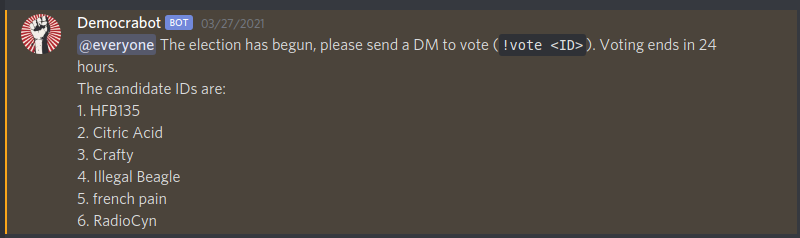
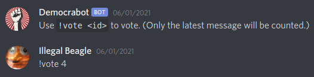
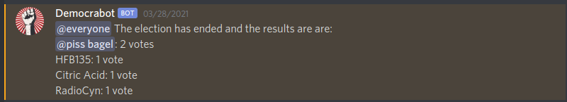

# Democraserver
Python code for managing the Democraserver.

## Usage
At 1pm AEST on the 1st of every month, the bot will post a numbered list of members in the top channel.

To vote, you must send `!vote {id}` (replace `{id}` with the number next to the candidate's name) to the bot via DMs.

The election will end at the same time the next day, and the bot will announce the winner and show how many votes everyone got.

